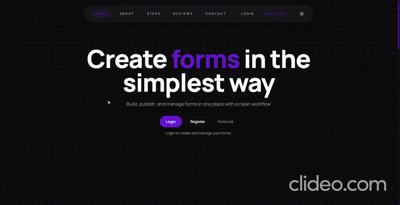
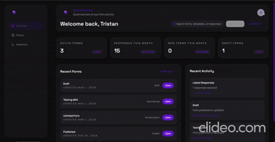
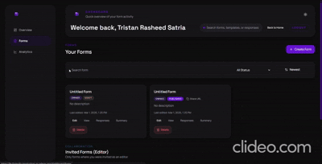
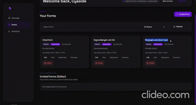
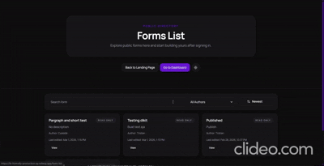
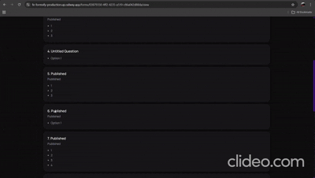
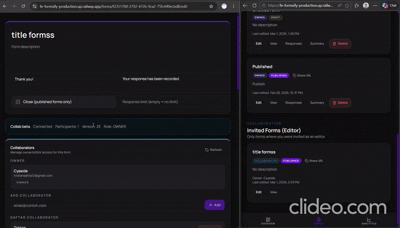

# Formsify Frontend (`fe-formsify`)

Frontend Formsify menggunakan Next.js (App Router) dan terhubung ke backend `be-formsify`.

## Repository Links

- Frontend repo: https://github.com/Cyaside/fe-formsify
- Backend repo: https://github.com/Cyaside/be-formsify

## Tech Stack

- Next.js 16 (App Router)
- React 19
- TypeScript 5
- Tailwind CSS 4
- TanStack React Query (server state/data fetching)
- Zustand (client state)
- DnD Kit (`@dnd-kit/core`, `@dnd-kit/sortable`) untuk drag-drop builder
- Socket.IO Client untuk realtime collaboration
- Recharts untuk analytics chart
- Framer Motion untuk animation/interactions

## Prasyarat

- Node.js 20+
- npm
- Backend sudah berjalan (default `http://localhost:4000`)

## Environment Variables

Buat file `fe-formsify/.env.local`: atau bisa lihat di .env.example

```env
NEXT_PUBLIC_API_BASE_URL=http://localhost:4000
NEXT_PUBLIC_GOOGLE_CLIENT_ID=
NEXT_PUBLIC_ENABLE_FORM_COLLAB=false
```

Keterangan:

- `NEXT_PUBLIC_API_BASE_URL`: base URL backend API.
- `NEXT_PUBLIC_GOOGLE_CLIENT_ID`: isi jika Google Sign-In dipakai.
- `NEXT_PUBLIC_ENABLE_FORM_COLLAB`: aktifkan fitur collab realtime di UI.

## Instalasi dan Menjalankan

```bash
cd fe-formsify
npm install
npm run dev
```

Frontend default di `http://localhost:3000`.

## Build dan Lint

```bash
npm run lint
npm run build
```

## Menjalankan di Production

```bash
npm run build
npm run start
```

`start` menggunakan `PORT` environment variable. Jika tidak diisi, gunakan port sesuai runtime platform.

## Catatan Integrasi Backend

- Pastikan `NEXT_PUBLIC_API_BASE_URL` mengarah ke backend yang benar.
- Pastikan backend mengizinkan origin frontend pada `CORS_ORIGIN`.
- Jika collab diaktifkan, backend juga harus set `ENABLE_FORM_COLLAB=true`.

## Notes Tambahan :

- Terkadang saat proses membuat form, ada bug kecil di mana perubahan terlihat revert (contoh: klik **Add question**, lalu pertanyaan sempat hilang dan perlu klik lagi) Ini biasanya masalah koneksi.
- Autosave menggunakan on-change namun Socket.IO tetap mengaktifkan **polling fallback transport** (kalau websocket gagal karena proxy atau network) untuk ningkatin stabilitas koneksi di deployment (khususnya di belakang proxy/load balancer), karena pure WebSocket kadang menyebabkan sync tidak stabil.

## Demo Video

### Login & Register



### Dashboard



### Form Builder 1



### Form Builder 2



### Fill Form



### Responses



### Collaboration


